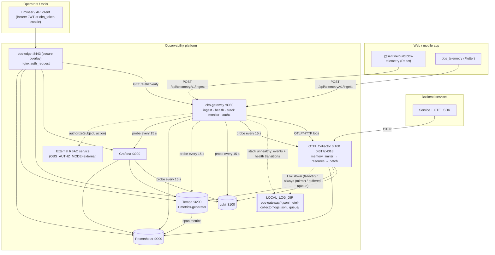
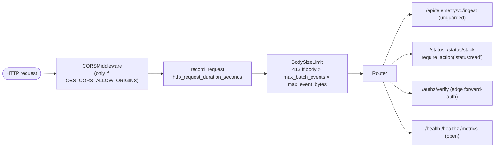
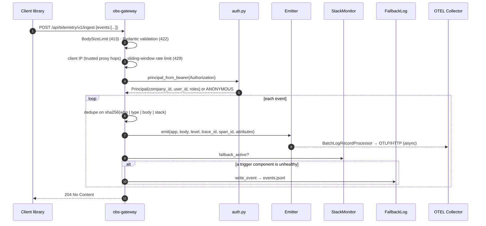
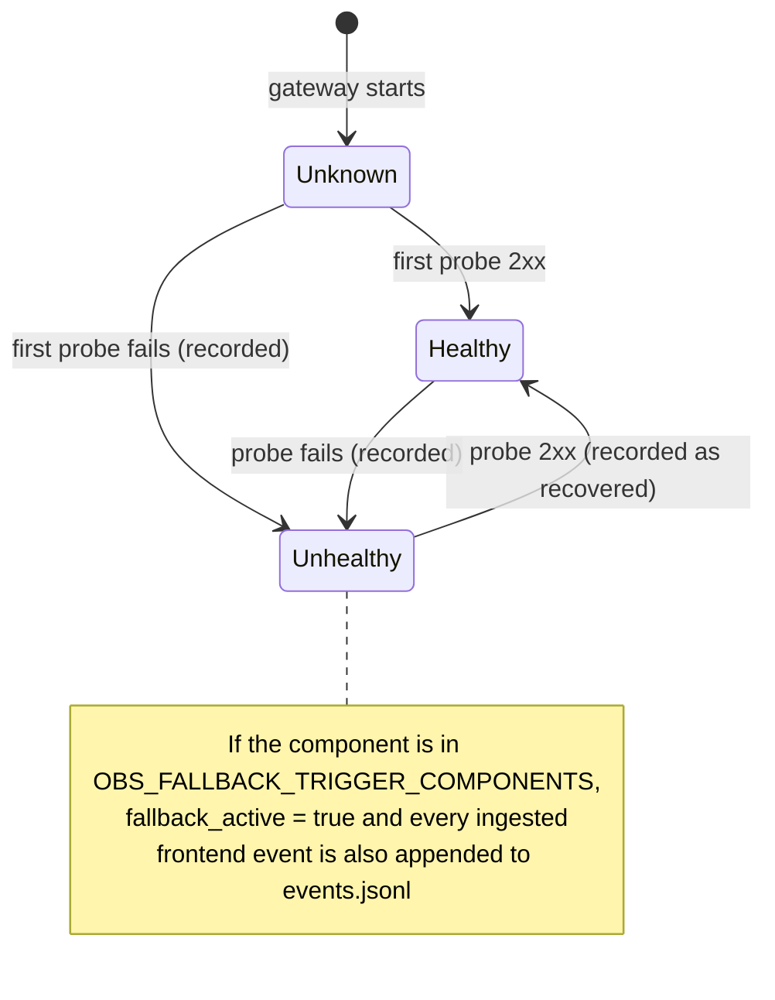
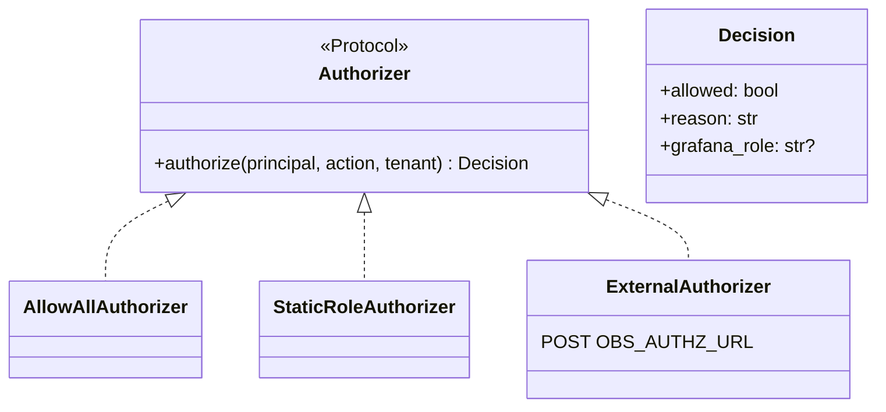
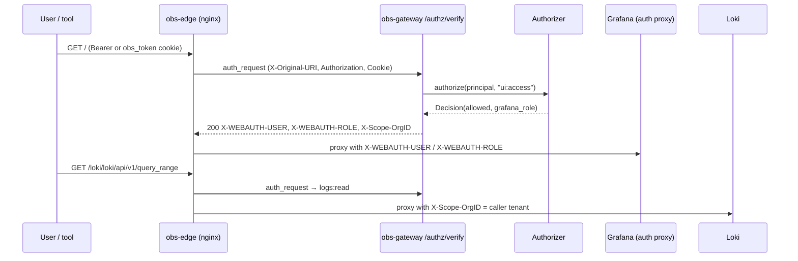

# SentinelBuild Observability Platform — Technical Design

| | |
|---|---|
| **Document** | Technical Design Document (TDD) |
| **Version** | 1.1 — obs-gateway 0.2.0, obs_telemetry (Flutter) 0.1.0, @sentinelbuild/obs-telemetry (React) 0.1.0, OTEL Collector 0.160.0 |
| **Companions** | [REQUIREMENTS.md](REQUIREMENTS.md) · [USER_MANUAL.md](USER_MANUAL.md) · [TEST_CASES.md](TEST_CASES.md) |

---

## 1. Overview

The platform collects **logs, traces, metrics and client-side telemetry** from a fleet of services and their web/mobile apps. It stores each signal in a purpose-built open-source store and presents them together in Grafana, with **trace↔log correlation**, **tenant filtering**, **stack self-monitoring with local-file fallback**, and an **RBAC integration seam** for UI and data access.

The components fall into two groups:

- **Off-the-shelf infrastructure**, run unmodified from pinned images and configured by files in this repo: OpenTelemetry Collector, Loki, Tempo, Prometheus, Grafana, and nginx (edge proxy and demo).
- **Code in this repo**:
  - **obs-gateway** (Python/FastAPI): the trust boundary for browser/app telemetry, fleet and stack health, local fallback logging, and RBAC decisions.
  - **obs_telemetry** (Flutter) and **@sentinelbuild/obs-telemetry** (React/browser): client libraries.

Design principles:

1. **Open standards in.** Backend services speak OTLP straight to the collector; nothing platform-specific is linked into them.
2. **Stateless gateway.** There is no database; everything is configuration. Horizontal scaling and extraction into another repo need no code change.
3. **Telemetry never hurts the app.** Ingest is fire-and-forget on both ends.
4. **Nothing silently lost or invisible.** When the stack behind Grafana is unhealthy, telemetry and health transitions are written to local files.
5. **Cardinality safety.** Tenant and user identifiers are log/trace attributes, never metric labels.
6. **Security by seam, not by fork.** RBAC is an interface with an allow-all default. A real RBAC product plugs in without touching routes or proxies.

---

## 2. Architecture

### 2.1 Component diagram



### 2.2 Why a gateway

- **Browsers must not talk to the collector directly.** Client telemetry needs a trust boundary that authenticates when it can, enriches with tenant and user, enforces caps and rate limits, and lives at the app's same origin.
- **The gateway already sits in the request path**, so it is also the natural place to:
  - aggregate fleet and stack health,
  - write local fallback logs,
  - answer authorization questions for the edge proxy.

### 2.3 Deployment topology (Docker Compose)

| Service | Image | Host port (dev) | Healthcheck | Starts after |
|---|---|---|---|---|
| `log-dir-init` | `busybox:1.36` (one-shot) | — | exits 0 | — |
| `obs-gateway` | built from `gateway/` (target `runtime`) | `127.0.0.1:8080` | Dockerfile `HEALTHCHECK` → `/health` | log-dir-init completed, collector started |
| `otel-collector` | `otel/opentelemetry-collector-contrib:0.160.0` | `127.0.0.1:4317`, `:4318` | none (distroless); `:13133` probed by the gateway stack monitor | log-dir-init; loki, tempo, prometheus healthy |
| `loki` | `grafana/loki:3.1.1` | — | `wget /ready` | — |
| `tempo` | `grafana/tempo:2.6.1` | — | `wget /ready` | prometheus healthy |
| `prometheus` | `prom/prometheus:v2.54.1` | `127.0.0.1:9090` | `wget /-/ready` | — |
| `grafana` | `grafana/grafana:11.2.2` | `127.0.0.1:3000` | `wget /api/health` | prometheus, loki, tempo healthy |
| `react-demo` (profile `demo`) | built from `examples/react-demo/` | `127.0.0.1:5173` | — | gateway healthy |
| `obs-edge` (secure overlay) | `nginxinc/nginx-unprivileged:1.27-alpine` | `127.0.0.1:8443` | — | gateway, grafana healthy |

All long-running containers use `restart: unless-stopped` and json-file log rotation (10 MB × 3). State lives in the named volumes `loki-data`, `tempo-data`, `prometheus-data` and `grafana-data`. Local fallback files go to the bind-mounted `LOCAL_LOG_DIR` (default `./logs`).

Config files are **bind-mounted read-only** from the repo. For example, `./loki/config.yml` appears inside the container as `/etc/loki/config.yml`, and `./otel-collector/` as `/etc/otelcol/`.

#### Compose files

| File | Purpose |
|---|---|
| `docker-compose.yml` | Base (development) stack, plus the `demo` profile. |
| `docker-compose.prod.yml` | Production override (§10.2). |
| `docker-compose.secure.yml` | RBAC-secured access through `obs-edge` (§9). |
| `docker-compose.test.yml` | Unit-test and lint runners. |
| `docker-compose.smoke.yml` | End-to-end smoke, outage and RBAC tests, merged onto the base stack. |

---

## 3. obs-gateway

### 3.1 Module structure

```text
gateway/src/obs_gateway/
├── main.py      FastAPI app, middleware stack, lifespan (stack monitor task, shutdown flush), /health /healthz /metrics
├── config.py    Settings (pydantic-settings, OBS_* env)
├── ingest.py    Ingest models, validation, rate limit, dedupe, client IP, route (+ fallback write)
├── emit.py      OTLP log emitter (one LoggerProvider per app), severity map
├── auth.py      Bearer JWT → Principal (tenant, user, roles); internal-key check
├── authz.py     RBAC seam: Authorizer protocol + none/static/external, route guard, /authz/verify
├── health.py    GET /status (fleet) and GET /status/stack (platform)
├── stack.py     Stack health monitor, fallback log files
└── metrics.py   Prometheus metrics + request-timing middleware
```

### 3.2 Request pipeline

Middleware, outermost first:



`BodySizeLimit` rejects on the declared `Content-Length`. It also counts streamed (chunked) bytes as they arrive, raising 413 from inside `receive()`.

### 3.3 Ingest flow



Validation runs before the handler, so requests that fail with 413 or 422 are not counted against the rate limit. The body-size cap bounds the cost of those rejections.

### 3.4 Ingest data model

`TelemetryBatch { events: TelemetryEvent[] }`, with at most `OBS_MAX_BATCH_EVENTS` (100) events; more → 422.

| Field | Type / constraint | Maps to (OTEL log record) |
|---|---|---|
| `type` | `log \| error \| event \| perf` (default `log`) | attribute `telemetry.type` |
| `level` | case-insensitive `trace \| debug \| info \| warn \| warning \| error \| fatal \| critical` (default `info`) | `severity_number`, `severity_text`; attribute `level` |
| `message` | ≤ 2000 chars | `body` (falls back to `error`, then `type`) |
| `error` | ≤ 2000 | attribute `error` |
| `stack` | ≤ 8000 | attribute `stack` |
| `url` | ≤ 2000 | attribute `url` |
| `app` | ≤ 64, `^[A-Za-z0-9._-]+$` | **resource** `service.name = frontend/<app>`; attribute `app` |
| `app_version` | ≤ 64 | attribute `app.version` |
| `trace_id` | 32 hex, not all zero (lowercased) | record `trace_id` |
| `span_id` | 16 hex, not all zero | record `span_id` |
| `context` | ≤ 32 entries; key 1–128 chars; value ≤ 1024; strings only | attributes `ctx.<key>` |
| *(whole event)* | JSON (`exclude_defaults`) ≤ `OBS_MAX_EVENT_BYTES` (16384) UTF-8 bytes | — |
| *(from JWT)* | — | attributes `company_id`, `user_id` |

Resource attributes: `service.name`, `deployment.environment` (= `OBS_ENVIRONMENT`). Null attributes are omitted.

### 3.5 Severity model

| Client `level` | OTEL `severity_number` | `severity_text` |
|---|---|---|
| `trace` | 1 (TRACE) | `TRACE` |
| `debug` | 5 (DEBUG) | `DEBUG` |
| `info` | 9 (INFO) | `INFO` |
| `warn`, `warning` | 13 (WARN) | `WARNING` |
| `error` | 17 (ERROR) | `ERROR` |
| `fatal`, `critical` | 21 (FATAL) | `CRITICAL` |

Unknown levels are rejected with 422.

### 3.6 Emitter

- There is one `LoggerProvider` per resource `service.name` (`frontend/<app>`, or `frontend` when `app` is missing). Each has its own `BatchLogRecordProcessor` → `OTLPLogExporter(<OBS_OTEL_ENDPOINT>/v1/logs)`.
- At most `MAX_APP_SERVICES = 32` providers exist; further apps are recorded as `frontend`. This bounds threads, memory and Loki stream cardinality.
- Export is asynchronous and export errors never reach the request. An empty `OBS_OTEL_ENDPOINT` means events go to stdout.
- On shutdown (lifespan exit on SIGTERM; uvicorn runs via `exec` as PID 1), every provider is flushed.
- The exporter honours `OTEL_EXPORTER_OTLP_HEADERS`, which the prod override uses to send the collector token.

### 3.7 Rate limiting and dedupe

| Mechanism | Key | Window | State bound |
|---|---|---|---|
| Rate limit | client IP | sliding 60 s; `OBS_RATE_LIMIT_PER_MIN` **requests** | When > 4096 keys, idle or stale IPs are pruned |
| Dedupe | `sha256(who \| type \| body \| stack)`; `who` = `company_id\|user_id` if authenticated, else client IP | `OBS_DEDUPE_WINDOW_SECONDS` | When > 4096 keys, expired entries are pruned; if all are live the map is cleared |

**Client IP.** With `OBS_TRUSTED_PROXY_HOPS = 0` (the default), `X-Forwarded-For` is ignored. With `N > 0`, the entry `N` from the right is the client.

**Per-replica state.** Both maps are process-local. With *R* replicas the effective limits are *R* × configured (constraint C-1).

### 3.8 Authentication and tenancy

- **Bearer token.** The token comes from `Authorization`, or from the `OBS_AUTHZ_TOKEN_COOKIE` cookie on guarded routes and forward-auth. It is verified with `OBS_JWT_SECRET` (HMAC) or `OBS_JWT_JWKS_URL` (PyJWKClient cached per URL).
- **Checks.** Signature, `exp` and the algorithm allow-list are always checked; `aud` and `iss` only when configured.
- **Claims.** Tenant, user and roles come from configurable claims: `org_id`, `sub` and `roles` by default. Roles may be a list or a space/comma-separated string.
- **Ingest never fails closed** on auth. Invalid tokens are treated as anonymous.
- **Tenancy.** `company_id` and `user_id` are Loki **structured metadata**, never metric labels.

### 3.9 Fleet health (`GET /status`)

- For each `name → base_url` in `OBS_HEALTH_TARGETS`, the gateway sends `GET base_url + OBS_HEALTH_PATH` concurrently with timeout `OBS_HEALTH_TIMEOUT_SECONDS`.
- A target is healthy only on HTTP 200. The rollup is 200 `ok` or 503 `degraded`, with a `status_code` or `error` per target.
- The route is guarded by `require_action("status:read")` (§9.3).

### 3.10 Stack health monitor and local fallback



**Monitor.** `StackMonitor.run()` is an asyncio task started in the FastAPI lifespan when `OBS_STACK_TARGETS` is non-empty.

- Every `OBS_STACK_CHECK_INTERVAL_SECONDS` (default 15) it probes all targets concurrently. Defaults:
  - `otel-collector` → `:13133/`
  - `loki` → `/ready`
  - `tempo` → `/ready`
  - `prometheus` → `/-/ready`
  - `grafana` → `/api/health`
- A component is healthy on any 2xx. Its detail is either `HTTP <code>` or the exception class name.
- A failing check never stops the loop.

**Fallback activation.** `fallback_active` is true while any component listed in `OBS_FALLBACK_TRIGGER_COMPONENTS` (default `otel-collector,loki,grafana`) is unhealthy. These are the components whose loss makes logs invisible in Grafana.

**Files.** `FallbackLog` writes JSON lines through `RotatingFileHandler` (`OBS_FALLBACK_LOG_MAX_BYTES` × `OBS_FALLBACK_LOG_BACKUP_COUNT`) into `OBS_FALLBACK_LOG_DIR`. Compose sets this to `/var/log/obs`, mounted from `${LOCAL_LOG_DIR}/obs-gateway`.

| File | Written when | Record |
|---|---|---|
| `stack-health.jsonl` | a component's first probe is unhealthy, or its health flips | `{time, component, state: unhealthy\|recovered, healthy, detail, previous_detail, fallback_active}` |
| `events.jsonl` | an event is ingested while `fallback_active` | `{time, service, level, body, trace_id, span_id, attributes}` |

- An empty `OBS_FALLBACK_LOG_DIR` disables the files.
- An unwritable directory logs `fallback_log_unavailable` once per path, and ingest continues.
- Events are still sent over OTLP too. If only Grafana is down, they also reach Loki, so a local copy may duplicate stored data by design.

**Exposure.**

- `GET /status/stack` returns `{status: unknown|ok|degraded, fallback_active, fallback_log_dir, components[]}`, with 503 when degraded. It is guarded like `/status`.
- Metrics: `obs_stack_component_up{component}`, `obs_fallback_active`, `obs_fallback_events_total`.

### 3.11 Gateway metrics (`GET /metrics`)

| Metric | Type | Labels |
|---|---|---|
| `http_request_duration_seconds` | histogram | `method`, `route` (template or `unmatched`), `status` |
| `obs_ingest_events_total` | counter | `outcome` = `accepted` \| `duplicate` |
| `obs_stack_component_up` | gauge | `component` |
| `obs_fallback_active` | gauge | — |
| `obs_fallback_events_total` | counter | — |

`/metrics` is intentionally unauthenticated so Prometheus can scrape it. It carries no tenant data.

### 3.12 Configuration

All settings come from `OBS_*` environment variables; see [User Manual §6](USER_MANUAL.md#6-configuration-reference).

- List settings accept comma-separated or JSON form.
- Map settings (`OBS_HEALTH_TARGETS`, `OBS_STACK_TARGETS`, `OBS_AUTHZ_ROLE_PERMISSIONS`, `OBS_AUTHZ_GRAFANA_ROLES`, `OBS_AUTHZ_ROUTE_ACTIONS`) are JSON.

---

## 4. Client libraries

Both libraries implement the same contract. They are fire-and-forget, batched, deduped, capped to the gateway limits, and retried within bounds.

| Concern | Flutter `obs_telemetry` | React `@sentinelbuild/obs-telemetry` |
|---|---|---|
| Entry point | `Telemetry.init(TelemetryConfig)` | `Telemetry.init(config)` |
| Error capture | `installErrorHandlers()`, `runGuarded()` | `installErrorHandlers()` (`error`, `unhandledrejection`), `<TelemetryErrorBoundary>` |
| Flush triggers | `maxBatch`, `flushInterval`, `flush()` | same, plus `pagehide` / hidden → `flushOnUnload()` (`fetch keepalive` ≤ 60 KB; `sendBeacon` fallback) |
| Batch size | clamped 1..100 | clamped 1..100 and ≤ 100 × 16384 bytes |
| Retry | network, timeout (4 s), 429, 5xx → requeue; other 4xx dropped | same; eager flushes pause after a retryable failure |
| Queue bound | `maxQueue` (500) | `maxQueue` (500) |
| Token | `getToken()` per flush; a throw means anonymous | same; unload uses a synchronous token only |
| Caps | all field caps; event ≤ 16384 bytes | same; invalid `app` characters replaced with `_` |
| Trace link | `traceId`/`spanId` | same, plus `createTraceContext()` |
| Quality gates | `flutter analyze`, `flutter test` | ESLint (type-aware), `tsc`, vitest; TypeScript 6.0 (the newest version typescript-eslint supports) |

### 4.1 Frontend ↔ backend trace correlation

```mermaid
sequenceDiagram
  participant App as Web app
  participant API as Backend (OTEL SDK)
  participant GW as obs-gateway
  participant G as Grafana
  App->>App: createTraceContext() → traceparent
  App->>API: fetch (traceparent header)
  API->>API: server span joins trace; logs carry trace_id
  API-->>App: 500
  App->>GW: Telemetry.error(e, {traceId, spanId})
  G->>G: Loki (frontend + backend logs) ⇄ Tempo trace
```

---

## 5. OpenTelemetry Collector (0.160.0)

### 5.1 Base pipelines (`otel-collector/config.yml`)

| Pipeline | Receivers | Processors | Exporter |
|---|---|---|---|
| logs | `otlp` (gRPC 4317, HTTP 4318) | `memory_limiter` → `resource` (insert `deployment.environment`) → `batch` | `otlp_http/loki` |
| traces | `otlp` | same | `otlp_grpc/tempo` |
| metrics | `otlp` | same | `prometheus_remote_write` |

The collector also runs the `health_check` extension on `:13133` and exposes its own metrics via a Prometheus pull reader on `:8888`.

Collector 0.160 uses snake_case component names: `otlp_http`, `otlp_grpc`, `prometheus_remote_write`. The upgrade from 0.109 was required for the `failover` connector.

### 5.2 Local-file fallback modes

The command merges `config.yml` with `fallback-${COLLECTOR_FALLBACK_MODE}.yml` (default `failover`), plus `config.prod.yml` in production.

| Mode | Overlay | Behaviour | Trade-off |
|---|---|---|---|
| **failover** (default) | `fallback-failover.yml` | Logs pipeline → `failover/logs` connector with priorities `[logs/loki]`, then `[logs/local_file]`. While Loki export fails, logs go to `/var/log/otelcol/logs.jsonl` (rotating `file` exporter). Loki is retried every 30 s and delivery switches back when it recovers. | The Loki exporter's queue and retries are disabled on this path so failures surface immediately; brief blips also go to the file. |
| **mirror** | `fallback-mirror.yml` | Logs are exported to Loki **and** `logs.jsonl`, always. | Always-on disk use (bounded by rotation). |
| **queue** | `fallback-queue.yml` | `file_storage/queue` extension; the Loki and Tempo exporters use a persistent sending queue with unlimited retry. Data accumulates in `/var/log/otelcol/queue` during outages and replays on recovery, surviving collector restarts. | The buffer is not human-readable. |

Rotation is `COLLECTOR_FALLBACK_MAX_MB` (50) × `COLLECTOR_FALLBACK_MAX_BACKUPS` (5). The directory is `${LOCAL_LOG_DIR}/otel-collector`, prepared by `log-dir-init` (uid 10001).

### 5.3 Production overlay

`config.prod.yml` adds the `bearertokenauth` extension (`${env:OTEL_INGEST_TOKEN}`) to both OTLP protocols.

---

## 6. Storage

### 6.1 Loki

Loki runs as a single binary with TSDB v13 on the filesystem. OTLP ingest is on `/otlp` with structured metadata, and the compactor enforces 30-day retention.

### 6.2 Tempo

Tempo runs as a single binary with local storage and 14-day retention. The metrics-generator (`service-graphs`, `span-metrics`) remote-writes to Prometheus with exemplars.

### 6.3 How OTLP appears in Loki

| OTLP | Loki |
|---|---|
| resource `service.name` | label `service_name` |
| resource `deployment.environment` | label `deployment_environment` |
| record `trace_id`, `span_id` | structured metadata |
| log attributes (`company_id`, `user_id`, `telemetry_type`, `ctx_*`, …) | structured metadata (dots → `_`) |

### 6.4 Prometheus

Prometheus scrapes `prometheus`, `otel-collector:8888`, `obs-gateway:8080`, `loki:3100`, `tempo:3200` and `grafana:3000`. The remote-write receiver and exemplar storage are enabled. Retention is `${PROMETHEUS_RETENTION:-15d}`.

### 6.5 Retention

| Signal | Default | Where |
|---|---|---|
| Logs | 30 d | `loki/config.yml` `retention_period` |
| Traces | 14 d | `tempo/config.yml` `block_retention` |
| Metrics | 15 d | `PROMETHEUS_RETENTION` |
| Local fallback files | size-rotated | `OBS_FALLBACK_LOG_*`, `COLLECTOR_FALLBACK_*` |

---

## 7. Grafana

- **Datasources** have fixed UIDs: `obs-prometheus`, `obs-loki` and `obs-tempo`.
  - Loki has a derived field `TraceID` pointing at Tempo.
  - Tempo has `tracesToLogsV2` pointing at Loki and `serviceMap` pointing at Prometheus.
- **Dashboard.** *Observability — Overview* (`obs-overview`) shows request rate, 5xx error % (0 % when there are no 5xx), p95 latency and logs.
- **Secure overlay.** Grafana runs in **auth-proxy** mode (§9.4).

---

## 8. Health checks summary

| Layer | Mechanism | Surfaces |
|---|---|---|
| Container | Docker healthchecks (gateway, Loki, Tempo, Prometheus, Grafana); `depends_on: service_healthy` start ordering | `docker compose ps` |
| Gateway itself | `/health` (liveness), `/healthz` (readiness) | orchestrators |
| Platform | Stack monitor (all components, including the healthcheck-less collector) | `/status/stack`, `obs_stack_component_up`, `stack-health.jsonl` |
| Fleet | `/status` over `OBS_HEALTH_TARGETS` | uptime monitors |
| Scrape | Prometheus `up` for every component | Grafana / alerts |

---

## 9. Security and RBAC

### 9.1 Threats and controls

| Threat | Control |
|---|---|
| Public ingest flooding | Body, field, event and batch caps; per-IP rate limit; dedupe; collector memory limiter |
| `X-Forwarded-For` spoofing | Ignored unless `OBS_TRUSTED_PROXY_HOPS` > 0 |
| Forged tenant attribution | JWT verification; invalid tokens become anonymous |
| Unbounded memory from client keys | Pruned maps; ≤ 32 per-app providers |
| Unauthorized UI, log, trace or metric access | `obs-edge` forward-auth → Authorizer (secure overlay) |
| Fleet or platform topology disclosure | `/status`, `/status/stack` guarded (internal key and/or `status:read`) |
| Unauthenticated OTLP in production | Collector `bearertokenauth` |
| Default credentials | Prod override requires secrets; secure overlay disables the Grafana login form |
| Store exposure | Loki and Tempo never published; Grafana's host port removed in the secure overlay |
| Container hardening | Non-root gateway (uid 10001), digest-pinned base, `nginx-unprivileged`, hadolint in CI |

### 9.2 Authorization model



- **Subject**: `Principal(user_id, company_id, roles)` from the JWT.
- **Actions**: `ui:access`, `logs:read`, `traces:read`, `metrics:read`, `status:read`. Telemetry ingest is deliberately unguarded (FR-3.2).

| `OBS_AUTHZ_MODE` | Implementation | Semantics |
|---|---|---|
| `none` (default) | `AllowAllAuthorizer` | Pre-RBAC behaviour. Routes only apply the internal-key guard; forward-auth passes everyone as `anonymous`/Viewer. |
| `static` | `StaticRoleAuthorizer` | Anonymous callers are denied. Permissions are the union over the token's roles in `OBS_AUTHZ_ROLE_PERMISSIONS`. `*` allows everything, including cross-tenant access; otherwise the requested tenant must equal the caller's `company_id`. The Grafana role is the highest mapped via `OBS_AUTHZ_GRAFANA_ROLES`. |
| `external` | `ExternalAuthorizer` (**integration stub**) | `POST OBS_AUTHZ_URL` with `{subject:{user_id,company_id,roles}, action, tenant}` expecting `200 {allowed, reason?, grafana_role?}`. It **fails closed** on error, timeout (`OBS_AUTHZ_TIMEOUT_SECONDS`), non-200 or a non-boolean `allowed`. Adapt the mapping to OpenFGA, OPA, Cerbos or an in-house API. |

Default static roles:

| Role | Permissions | Grafana role |
|---|---|---|
| `obs-admin` | `*` | Admin |
| `obs-editor` | `ui:access`, `logs:read`, `traces:read`, `metrics:read`, `status:read` | Editor |
| `obs-viewer` | `ui:access`, `logs:read`, `traces:read`, `metrics:read` | Viewer |

### 9.3 Enforcement points

1. **Gateway routes.** `require_action(action)` guards `/status` and `/status/stack`.
   - With RBAC off, only `OBS_INTERNAL_API_KEY` is checked.
   - With RBAC on, a valid internal key (service callers) is accepted. Otherwise a bearer token or cookie is required: 401 if missing or invalid, 403 if the authorizer denies.
2. **Edge forward-auth.** `GET /authz/verify` is called by nginx `auth_request` (Traefik ForwardAuth and Envoy ext_authz work the same way).
   - The original path (`X-Original-URI` / `X-Forwarded-Uri`) maps to an action by `OBS_AUTHZ_ROUTE_ACTIONS` (first prefix match): `/loki/` → `logs:read`, `/tempo/` → `traces:read`, `/prometheus/` → `metrics:read`, `/` → `ui:access`.
   - 200 returns `X-WEBAUTH-USER`, `X-WEBAUTH-ROLE`, `X-Obs-Action` and, when the caller has a tenant, `X-Scope-OrgID`.
   - 401 or 403 returns `X-Obs-Authz-Reason`.

### 9.4 Secure access overlay (`docker-compose.secure.yml`)



- `obs-edge` on `127.0.0.1:8443` becomes the only route to the UI and the store APIs.
- Grafana: `GF_AUTH_PROXY_ENABLED`, user from `X-WEBAUTH-USER`, `Role:X-WEBAUTH-ROLE`, auto sign-up, header trust restricted by `GF_AUTH_PROXY_WHITELIST` (private ranges by default), login form disabled, host port removed.
- `OBS_AUTHZ_MODE` defaults to `static` in this overlay.

**Integration steps still left to the adopter** (constraint C-3):

- Enable Loki and Tempo multi-tenancy (`auth_enabled: true`), so that `X-Scope-OrgID` is enforced and the collector writes per-tenant.
- Implement `ExternalAuthorizer` against the chosen RBAC product.
- Issue `roles` in the IdP's tokens.

---

## 10. Deployment

### 10.1 Development

`docker compose up -d`. Add `--profile demo` for the React demo.

### 10.2 Production override

```bash
docker compose -f docker-compose.yml -f docker-compose.prod.yml [-f docker-compose.secure.yml] up -d
```

The override:

- requires `GRAFANA_ADMIN_PASSWORD`, `OTEL_INGEST_TOKEN` and `OBS_INTERNAL_API_KEY`,
- enables collector token auth and publishes 4317/4318 (put TLS in front),
- stops publishing Prometheus,
- sets `OBS_TRUSTED_PROXY_HOPS=1`,
- secures Grafana cookies and adds resource limits.

### 10.3 Cloud / Kubernetes

Run each component as its own service. Move Loki and Tempo to object storage. Use memberlist for Loki's ring. Mount `LOCAL_LOG_DIR` on a persistent volume, or ship those files with the node's log agent.

---

## 11. Quality gates and testing

| Gate | Tool | Runs in |
|---|---|---|
| Gateway lint and types | ruff, `mypy --strict` | `gateway-tests`, CI |
| Gateway tests | pytest, FastAPI TestClient, real OTEL SDK with in-memory exporter, httpx `MockTransport`; coverage ≥ 90 % | `gateway-tests`, CI |
| React client | ESLint (typescript-eslint type-checked, react-hooks), `tsc`, vitest + jsdom | `react-client-tests`, CI |
| React demo | ESLint, `tsc`, Vite build | `react-demo-lint`, CI |
| Flutter client | `flutter analyze` (flutter_lints), `flutter test` | `flutter-client-tests`, CI |
| Dockerfiles | hadolint (`.hadolint.yaml`) | `lint-dockerfiles`, CI |
| YAML | yamllint (`.yamllint.yaml`) | `lint-yaml`, CI |
| Markdown | markdownlint-cli2 (`.markdownlint-cli2.jsonc`) | `lint-markdown`, CI |
| Compose and collector configs | `docker compose config`, `otelcol validate` (every fallback mode) | CI |
| End-to-end | `tests/smoke/smoke_test.py` | `docker-compose.smoke.yml`, CI |
| Outage and fallback | `tests/smoke/outage_test.sh` | CI |
| RBAC edge | `tests/smoke/rbac_edge_test.sh` | CI |

The test catalogue and traceability are in [TEST_CASES.md](TEST_CASES.md).

---

## 12. Extensibility

- **RBAC.** Implement `Authorizer`, select it in `get_authorizer()`, and extend `OBS_AUTHZ_ROUTE_ACTIONS` for new protected paths.
- **Signal sources.** Anything that speaks OTLP.
- **Backends.** Add collector exporters; the ingest contract is unchanged.
- **Alerting.** Grafana alerts on `obs_stack_component_up == 0`, `obs_fallback_active == 1`, and error rates.
- **Local log shipping.** Point a node log agent at `LOCAL_LOG_DIR` to forward fallback files elsewhere.

---

## 13. Design decisions

| # | Decision | Alternatives | Rationale |
|---|---|---|---|
| D-1 | In-memory rate-limit and dedupe state | Redis | No datastore (NFR-1/2); per-replica limits documented |
| D-2 | Reject an invalid batch as a whole (422) | Partial accept | Explicit contract; clients cap events |
| D-3 | Per-app `LoggerProvider` | One resource plus an attribute | First-class `service_name` per app; bounded to 32 |
| D-4 | `company_id` as structured metadata | Index label | Avoids per-tenant stream cardinality |
| D-5 | Unknown `level` → 422 | Map to INFO | Canonical severity text |
| D-6 | Probes and `/metrics` open; `/status*` guarded | Guard everything | Orchestrators and Prometheus need unauthenticated access |
| D-7 | Collector token auth only in prod | Always | Zero-config development |
| D-8 | Stack monitor in the gateway | Separate monitor container | Already stateless, in the ingest path, and able to divert events locally |
| D-9 | Three selectable collector fallback modes, default failover | One fixed behaviour | Different operators trade disk use, readability and loss tolerance differently; the modes are mutually exclusive (a persistent queue masks the failures that trigger failover) |
| D-10 | Collector upgraded 0.109 → 0.160 | Stay on 0.109 | `failover` connector availability; snake_case component names adopted |
| D-11 | RBAC as a Protocol with allow-all default and an external HTTP stub | Embed a specific RBAC product | Keeps the platform product-agnostic; integration is one class |
| D-12 | Forward-auth at an nginx edge plus Grafana auth proxy | Grafana OAuth only | One decision point for the UI **and** direct store APIs |
| D-13 | React client on TypeScript 6.0 | TypeScript 7 | typescript-eslint supports TypeScript < 6.1 only |
