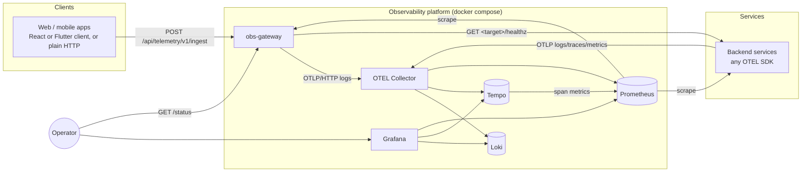

# SentinelBuild Observability Platform — Requirements Specification

| | |
|---|---|
| **Document** | Software Requirements Specification (SRS) |
| **Version** | 1.2 — supersedes the v0 draft, v1.0 and v1.1; adds stack health checks, local fallback logs, RBAC and lint gates |
| **Applies to** | obs-gateway 0.2.0 · obs_telemetry (Flutter) 0.1.0 · @sentinelbuild/obs-telemetry (React) 0.1.0 · OTEL Collector 0.160.0 |
| **Companions** | [DESIGN.md](DESIGN.md) · [USER_MANUAL.md](USER_MANUAL.md) · [TEST_CASES.md](TEST_CASES.md) |
| **Status** | Baseline. Every requirement has a compliance status and the tests that verify it. |

---

## 1. Introduction

### 1.1 Purpose

This document defines what the observability platform must do and how well it must do it. For each requirement it also records how compliance is verified.

### 1.2 Product scope

The platform is **one centralized, tenant-aware system** for **logs, metrics, traces and frontend Real-User Monitoring (RUM)**, plus **fleet health status**, across a fleet of backend services and their web/mobile frontends. The goal is end-to-end observability, from a user action in a client through every backend hop.

It must:

- run standalone with a single command,
- integrate with any service only through open standards (OTLP) and configuration,
- be extractable into its own repository with no code changes to any host platform.

### 1.3 Definitions

| Term | Meaning |
|---|---|
| **OTLP** | OpenTelemetry Protocol, the vendor-neutral wire format for logs, metrics and traces (gRPC 4317, HTTP 4318). |
| **RUM** | Real-User Monitoring: telemetry captured in a user's client (errors, logs, navigation, performance). |
| **Signal** | One kind of telemetry: log, metric or trace. |
| **Tenant** | The customer organisation a user belongs to, identified by `company_id`. |
| **Principal** | Tenant (`company_id`) and user (`user_id`) resolved from a request's bearer token. Anonymous when absent or invalid. |
| **Collector** | The OpenTelemetry Collector: the single OTLP ingest point that routes signals to the stores. |
| **Gateway** | `obs-gateway`: the HTTP trust boundary for client telemetry and the fleet-health API. |
| **Client library** | `obs_telemetry` (Flutter) or `@sentinelbuild/obs-telemetry` (React/browser). |
| **Fleet** | The set of services whose readiness `/status` aggregates. |
| **Cardinality** | The number of distinct label-value combinations in a metric or index. High cardinality degrades the store. |

### 1.4 Conventions

- **FR-n** is a functional requirement and **NFR-n** a non-functional one. IDs are stable across versions.
- Sub-clauses (e.g. **FR-4.2**) split a compound requirement into testable parts.
- **Verification** references test IDs in [TEST_CASES.md](TEST_CASES.md): `GW` gateway, `RC` React, `FC` Flutter, `E2E` smoke, `DEP` deployment, `MAN` manual.
- **Status** values:
  - **Met**: implemented and verified by automated tests.
  - **Met (manual)**: verified by a manual case.
  - **Partial**: implemented with a documented limitation.

---

## 2. Stakeholders and personas

| Persona | Needs |
|---|---|
| **Operator / SRE** | A single pane (Grafana), fleet and platform health at a glance, alerting when SLOs break, and local log files when Grafana or the pipeline behind it is unreachable. |
| **Security / platform owner** | Authenticated, role-based access to the Grafana UI and to log, trace and metric data, pluggable into the organisation's RBAC solution. |
| **Developer** | To follow one request across services with its exact log lines, filtered to a tenant, without bespoke wiring per service. |
| **Frontend engineer** | Client crashes, errors and page/performance events captured and correlated to the backend request that served them. |
| **Platform integrator** | To drop the stack into a new environment and connect services using environment variables only. |

---

## 3. System context

The external interfaces, which together are the **whole** integration surface and are all configuration:

1. **OTLP endpoint** (collector `:4317` / `:4318`) for backend services.
2. **Ingest contract** `POST /api/telemetry/v1/ingest` for frontends (§6.1), or the client libraries.
3. **Health target map** `OBS_HEALTH_TARGETS` for `/status`.
4. **Prometheus scrape config** for services exposing `/metrics`.

---

## 4. Functional requirements

### 4.1 Ingest

| ID | Requirement | Verification | Status |
|---|---|---|---|
| **FR-1** | The system shall accept **OTLP logs, metrics and traces** over **gRPC and HTTP** from any instrumented service. | E2E-3, E2E-4 | **Met** |
| **FR-2** | The system shall accept **frontend/app telemetry** (errors, logs, page/navigation events, performance events) in **batches** over HTTP, with authentication optional. First-party client libraries shall be provided for **Flutter** and **React/browser**. | GW-1–3, RC-10, RC-19–23, FC-1, E2E-1, MAN-1 | **Met** |
| **FR-3.1** | When a valid bearer token is present and verification is configured (HMAC secret or JWKS), frontend events shall be enriched with **tenant (`company_id`)** and **user (`user_id`)**. | GW-22, GW-26–29, GW-32, E2E-6 | **Met** |
| **FR-3.2** | Events with no token or an invalid token shall be accepted **anonymously**. | GW-23–25, RC-13, FC-4 | **Met** |
| **FR-3.3** | The JWT claim names for tenant and user shall be configurable. | GW-28 | **Met** |
| **FR-4.1** | Ingest shall enforce **field-size caps** on every event field, including `context` (≤ 32 entries, key ≤ 128, value ≤ 1024). It shall also cap the **whole event** (`OBS_MAX_EVENT_BYTES`) and the **request body** (`max_batch_events × max_event_bytes`). An over-limit event → **422**; an over-limit body → **413**. | GW-5–7, GW-48–50, E2E-12, E2E-14 | **Met** |
| **FR-4.2** | Ingest shall enforce a **per-client rate limit** (requests per sliding minute per client IP) and respond **429** when it is exceeded. `X-Forwarded-For` shall be trusted only for a configured number of proxy hops. | GW-16–21, E2E-15 | **Met** — limits are per gateway replica (see C-1) |
| **FR-4.3** | Ingest shall **drop duplicate events** within a short window, keyed per sender (tenant and user when authenticated, else client IP), so a client error loop cannot flood the pipeline while identical errors from different tenants are all kept. | GW-10–15 | **Met** |
| **FR-4.4** | A batch shall contain at most `OBS_MAX_BATCH_EVENTS` events; a larger batch shall be rejected with **422**. | GW-8, E2E-13 | **Met** |
| **FR-5.1** | Ingest shall be **fire-and-forget**: invalid input is rejected (413/422/429) and no input can crash the gateway. Client libraries shall never throw into app code, shall retry transient failures (network, timeout, 429, 5xx) within a bounded queue, and shall drop permanently rejected batches. | GW-5, RC-15–18, FC-7–9 | **Met** |
| **FR-5.2** | A collector outage shall **never fail an ingest request**. | GW-45–46, MAN-6 | **Met** |

### 4.2 Storage and query

| ID | Requirement | Verification | Status |
|---|---|---|---|
| **FR-6** | The system shall persist logs (Loki), traces (Tempo) and metrics (Prometheus) with **configurable retention per signal**. | MAN-10 | **Met (manual)** — defaults 30 d / 14 d / 15 d |
| **FR-7.1** | All three stores shall be available in **Grafana as one pane**, with provisioned datasources and an overview dashboard. | E2E-7 | **Met** |
| **FR-7.2** | Grafana shall provide **trace↔log correlation** on `trace_id` in both directions, plus a **service graph** derived from traces. | E2E-4, E2E-9, MAN-2, MAN-3 | **Met** — link navigation in the UI is a manual check |

### 4.3 Correlation and tenancy

| ID | Requirement | Verification | Status |
|---|---|---|---|
| **FR-8.1** | Every signal shall carry `service.name` and `deployment.environment`. Frontend events shall use the resource `service.name` `frontend/<app>`. | GW-41, GW-44, E2E-5 | **Met** — at most 32 distinct apps per replica; further apps are recorded as `frontend` |
| **FR-8.2** | Where applicable, signals shall carry `trace_id` and `company_id`. Frontend events shall accept `trace_id`/`span_id`, so a client error links to the backend trace of the request it concerns. | GW-9, GW-41, RC-6, RC-24, FC-15, E2E-5 | **Met** |
| **FR-9** | `company_id` shall be a log/trace attribute (stored as Loki structured metadata) and **never a Prometheus metric label**. | E2E-6; `metrics.py` defines no tenant label | **Met** |

### 4.4 Health

| ID | Requirement | Verification | Status |
|---|---|---|---|
| **FR-10.1** | `GET /status` shall probe the readiness of a **configurable set of services** concurrently and return per-service results plus a rollup. | GW-36–37 | **Met** |
| **FR-10.2** | `/status` shall return **503** `degraded` when any target is not HTTP 200 within the timeout, with a status code or error per target. | GW-38–39, E2E-11 | **Met** |
| **FR-10.3** | The gateway shall expose its own liveness (`/health`) and readiness (`/healthz`) endpoints. | GW-35 | **Met** |

### 4.4a Stack health and local fallback

| ID | Requirement | Verification | Status |
|---|---|---|---|
| **FR-13.1** | Every platform component shall have a built-in health check. Docker healthchecks gate startup order. Components whose image cannot run one (the collector) are covered by the gateway's stack monitor. | DEP-1, E2E-16 | **Met** |
| **FR-13.2** | The gateway shall probe the collector, Loki, Tempo, Prometheus and Grafana on a configurable interval, and expose the result at `GET /status/stack` (503 when degraded) and as metrics. | GW-55–61, GW-62–64, E2E-16 | **Met** |
| **FR-14.1** | Whenever a stack component becomes unhealthy or recovers, a record shall be appended to a local rotating log file (`stack-health.jsonl`). | GW-56–57, OUT-3, OUT-8 | **Met** |
| **FR-14.2** | While any configured trigger component (default collector, Loki, Grafana) is unhealthy, every ingested frontend event shall also be written to a local rotating log file (`events.jsonl`). | GW-65–67, GW-94–95, OUT-2, OUT-4–5 | **Met** |
| **FR-14.3** | Backend OTLP logs shall be written to a local rotating file when Loki is unreachable, with a selectable mode: `failover` (file only during an outage, default), `mirror` (always), `queue` (persistent on-disk buffer, replayed on recovery). | DEP-3, OUT-6, MAN-11 | **Met** |
| **FR-14.4** | The local log directory, rotation limits, check interval, probe targets, trigger components and collector mode shall be configurable through the environment. | GW-53, User Manual §6 | **Met** |

### 4.4b Access control (RBAC integration)

| ID | Requirement | Verification | Status |
|---|---|---|---|
| **FR-15.1** | The platform shall provide an authorization seam (`Authorizer` protocol) deciding `(subject, action, tenant)` for the actions `ui:access`, `logs:read`, `traces:read`, `metrics:read` and `status:read`, with selectable implementations: `none` (default, unchanged behaviour), `static` (JWT roles → permissions) and `external` (stub calling an RBAC service over HTTP, failing closed). | GW-68–83 | **Met** (stub by design) |
| **FR-15.2** | Gateway operational endpoints (`/status`, `/status/stack`) shall enforce `status:read` when RBAC is enabled, while still accepting the internal service key. | GW-85–87 | **Met** |
| **FR-15.3** | The Grafana UI and the Loki, Tempo and Prometheus APIs shall be reachable through a single edge proxy that authorizes every request through the gateway (`/authz/verify`), passing the user and role to Grafana and the tenant (`X-Scope-OrgID`) to the stores. | GW-84, GW-89–92, RBAC-1–10 | **Met** |
| **FR-15.4** | Telemetry ingest shall remain unguarded by RBAC (anonymous pre-login crashes, FR-3.2). | GW-88 | **Met** |

### 4.5 Logging levels

| ID | Requirement | Verification | Status |
|---|---|---|---|
| **FR-11** | The severities **TRACE, DEBUG, INFO, WARNING, ERROR, CRITICAL** (aliases **WARN**, **FATAL**) shall be supported end to end, mapped to OTEL severity numbers with canonical severity text. Unknown levels shall be rejected (422). | GW-4, GW-43, FC-17 | **Met** |
| **FR-12** | Log verbosity shall be **environment-configurable per process** with no code change. Client events carry a per-event level. | MAN-4 | **Met (manual)** |

---

## 5. Non-functional requirements

| ID | Quality | Requirement | Verification | Status |
|---|---|---|---|---|
| **NFR-1** | Self-contained | `docker compose up` starts the whole platform with no dependency on a host platform's code, database or auth. Tenant and user extraction and health targets are configuration. | E2E suite, DEP-1, GW-53–54 | **Met** |
| **NFR-2** | Portable | Standard OTLP in; pinned images; a **stateless** gateway that scales horizontally. | DEP-1 | **Met** — see C-1 (per-replica limits) |
| **NFR-3** | Secure | UIs on loopback by default; secrets via env; JWT verification (signature, `exp`, optional `aud`/`iss`, algorithm allow-list); internal-key guard on `/status`; no wildcard CORS with credentials; untrusted `X-Forwarded-For` ignored. A production override that **requires** non-default secrets, enables **token auth on OTLP ingest** and publishes no stores. | GW-18, GW-30–31, GW-34, GW-40, E2E-10, DEP-2–3, MAN-8–9 | **Met** |
| **NFR-4** | Resilient | A telemetry burst cannot exhaust memory in the collector (memory limiter) or the gateway (body, event and batch caps, bounded rate-limit, dedupe and provider maps). Clients bound their queues. Buffered telemetry is flushed on graceful shutdown. Components are restart-safe with dependency-ordered, health-gated startup. | GW-15, GW-21, GW-44, GW-47, RC-16, FC-9, MAN-5 | **Met** |
| **NFR-5** | Low-friction adoption | A service integrates by setting OTEL env vars. A frontend integrates with a client library or by POSTing a documented JSON shape. | User Manual §4–5 | **Met** |
| **NFR-6** | Quality gates | Gateway: ruff, `mypy --strict`, pytest with a coverage floor of **90 %**. React client and demo: ESLint (type-aware), `tsc`, vitest. Flutter: `flutter analyze`, tests. Repository: hadolint (Dockerfiles), yamllint (YAML), markdownlint (docs). All enforced in **CI**, which also runs the smoke, outage and RBAC edge tests. | `.github/workflows/ci.yml`, LINT-1–6 | **Met** |
| **NFR-7** | Platform observability | Every platform component exposes health and Prometheus metrics, and Prometheus scrapes all of them. | GW-51–52, E2E-8, DEP-5 | **Met** |
| **NFR-8** | Licensing | Gateway and client code are MIT; bundled third-party images run unmodified under their own licences. | `LICENSE`, README | **Met** |
| **NFR-9** | Testable without local toolchains | All unit suites, linters and the smoke test run in Docker via compose files. | DEP-1, User Manual §10 | **Met** |
| **NFR-10** | Operability during outages | Loss of Grafana, Loki or the collector shall never make telemetry invisible or crash ingest; recovery is automatic and recorded. | OUT-1–8 | **Met** |

---

## 6. Interface requirements

### 6.1 Ingest contract (normative)

`POST /api/telemetry/v1/ingest`, `Content-Type: application/json`, optional `Authorization: Bearer <jwt>`.

| Field | Type | Default | Constraint |
|---|---|---|---|
| `events` | array of event | `[]` | ≤ `OBS_MAX_BATCH_EVENTS` (100) |
| `events[].type` | `log` \| `error` \| `event` \| `perf` | `log` | enum |
| `events[].level` | string | `info` | case-insensitive `trace`, `debug`, `info`, `warn`, `warning`, `error`, `fatal`, `critical` |
| `events[].message` | string | `""` | ≤ 2000 chars |
| `events[].error` | string \| null | null | ≤ 2000 chars |
| `events[].stack` | string \| null | null | ≤ 8000 chars |
| `events[].url` | string \| null | null | ≤ 2000 chars |
| `events[].app` | string \| null | null | ≤ 64 chars, `^[A-Za-z0-9._-]+$` |
| `events[].app_version` | string \| null | null | ≤ 64 chars |
| `events[].trace_id` | string \| null | null | 32 hex chars, not all zero |
| `events[].span_id` | string \| null | null | 16 hex chars, not all zero |
| `events[].context` | object string → string | `{}` | ≤ 32 entries; key 1–128 chars; value ≤ 1024 chars |
| *(event)* | — | — | serialised JSON ≤ `OBS_MAX_EVENT_BYTES` (16384) bytes |
| *(body)* | — | — | ≤ `OBS_MAX_BATCH_EVENTS × OBS_MAX_EVENT_BYTES` bytes |

| Response | Meaning |
|---|---|
| **204** | Accepted. Includes events suppressed by dedupe. |
| **413** | Body too large. |
| **422** | Validation failure; the whole batch is rejected. |
| **429** | Rate limited. |

### 6.2 Health contract

- `GET /health`, `GET /healthz` → `200 {"status":"ok","service":"obs-gateway"}`.
- `GET /status` (header `X-Internal-Key` when `OBS_INTERNAL_API_KEY` is set, else 401) → `200` or `503` `{"status":"ok"|"degraded","healthy":n,"total":m,"services":[{"service","ok","status_code"|"error"}]}`. With no targets it returns 200 with `healthy:0,total:0,services:[]` plus a `note`.

- `GET /status/stack` (same guard as `/status`) → `200` or `503` `{"status":"unknown"|"ok"|"degraded","fallback_active":bool,"fallback_log_dir":str|null,"components":[{"component","healthy","detail","checked_at"}]}`.
- When `OBS_AUTHZ_MODE` is not `none`, `/status` and `/status/stack` accept a valid `X-Internal-Key`, or a bearer token or `obs_token` cookie whose roles grant `status:read` (401 unauthenticated, 403 denied).

### 6.3 Metrics contract

`GET /metrics` (Prometheus text format) exposes:

- `http_request_duration_seconds{method,route,status}`
- `obs_ingest_events_total{outcome}`
- `obs_stack_component_up{component}`
- `obs_fallback_active`
- `obs_fallback_events_total`

### 6.4 Forward-auth contract

`GET /authz/verify` is called by the edge proxy with `X-Original-URI` (or `X-Forwarded-Uri`) and the caller's `Authorization` / `Cookie` headers.

| Response | Headers |
|---|---|
| `200` | `X-Obs-Action`, `X-WEBAUTH-USER`, `X-WEBAUTH-ROLE`, and `X-Scope-OrgID` when the caller has a tenant |
| `401` / `403` | `X-Obs-Authz-Reason` |

### 6.5 Local log file formats

JSON lines, one object per line:

- `obs-gateway/stack-health.jsonl`: `{time, component, state, healthy, detail, previous_detail, fallback_active}`
- `obs-gateway/events.jsonl`: `{time, service, level, body, trace_id, span_id, attributes}`
- `otel-collector/logs.jsonl`: OTLP/JSON `resourceLogs` from the collector `file` exporter.

---

## 7. Constraints, assumptions and dependencies

- **Runtime:** Docker Engine with Compose v2.24 or later.
- **Gateway:** Python ≥ 3.11 (image 3.12-slim, digest-pinned); FastAPI, Pydantic v2, pydantic-settings ≥ 2.7, PyJWT ≥ 2.10, prometheus-client, OpenTelemetry SDK ≥ 1.44 < 2.
- **Clients:** Flutter ≥ 3.10 / Dart ≥ 3.3 with `package:http`; React ≥ 18 (peer), zero runtime dependencies.
- **Pinned stack:** otel-collector-contrib 0.160.0, Loki 3.1.1, Tempo 2.6.1, Prometheus v2.54.1, Grafana 11.2.2, nginx-unprivileged 1.27, busybox 1.36.
- **Assumptions:** backend services are instrumented with an OpenTelemetry SDK; production frontends reach the gateway through a same-origin reverse proxy with TLS; v1 storage is the local filesystem.

### 7.1 Known constraints

| ID | Constraint | Rationale |
|---|---|---|
| **C-1** | Rate-limit and dedupe state is in-memory per gateway replica, so with *R* replicas the effective limits are *R* × configured. | Keeps the gateway free of a datastore (NFR-1/2). Documented in DESIGN §3.7 and User Manual §8.4. |
| **C-2** | Validation failures (413/422) are not counted against the rate limit. | Validation runs before the handler. Its cost is bounded by the body-size cap. |
| **C-3** | RBAC is an integration stub. `ExternalAuthorizer` must be adapted to the chosen RBAC product. Loki and Tempo multi-tenancy (`auth_enabled`) must be switched on for the edge's `X-Scope-OrgID` to enforce tenant isolation in the stores. | Keeps the platform product-agnostic; see DESIGN §9.4. |
| **C-4** | On page unload the React client can attach only a synchronously available token; `sendBeacon` sends are anonymous. | Browser API limitations. |
| **C-5** | In `failover` mode the collector's Loki exporter has no in-memory queue or retry, so brief Loki blips also divert logs to the local file. In `queue` mode the local buffer is not human-readable. | Required for failover detection; alternatives are the `mirror` and `queue` modes. |
| **C-6** | The React client uses TypeScript 6.0. | typescript-eslint supports TypeScript < 6.1. |

---

## 8. Resolved issues (from the v1.0 review)

The v1.0 baseline recorded these gaps against commit `4ddbe6a`. All are resolved in this version.

| Gap | Finding in v1.0 | Resolution | Verified by |
|---|---|---|---|
| **G-0** | *Critical:* `emit.py` imported `LogRecord` from `opentelemetry.sdk._logs`, which current SDKs (1.44) no longer export. Every frontend event was silently dropped while clients received 204. | Import from `opentelemetry._logs`; SDK pinned ≥ 1.44; emitter tested against the real SDK. | GW-41–47, E2E-5 |
| **G-1** | No trace-context field on frontend events. | Added `trace_id`/`span_id` to the contract and both clients; React adds `createTraceContext()`. | GW-9, RC-24, FC-15, E2E-5 |
| **G-2** | `OBS_INTERNAL_API_KEY` had no effect. | `/status` requires `X-Internal-Key` when set. | GW-40, E2E-10 |
| **G-3** | `OBS_MAX_EVENT_BYTES` unused; `context` and body uncapped. | Event byte cap, context caps, streaming body limit (413). | GW-5–7, GW-48–50 |
| **G-4** | Oversized batches silently truncated. | Rejected with 422. | GW-8, E2E-13 |
| **G-5** | `X-Forwarded-For` trusted unconditionally. | `OBS_TRUSTED_PROXY_HOPS` (default 0). | GW-18–20 |
| **G-6** | Dedupe merged identical errors across tenants. | Signature includes the sender. | GW-13–14 |
| **G-7** | Per-replica limit state. | Accepted by design; documented as **C-1**. | — |
| **G-8** | All frontend logs shared `service.name=frontend-telemetry`. | Per-app resource `frontend/<app>` (bounded). | GW-44, E2E-5 |
| **G-9** | Tempo service map non-functional. | Tempo metrics-generator (service-graphs, span-metrics). | E2E-9 |
| **G-10** | Free-text `level`, arbitrary severity text. | Enum validation plus canonical severity text. | GW-4–5, GW-43 |
| **G-11** | Rate-limit map never pruned. | Pruned above 4096 keys. | GW-21 |
| **G-12** | Missing tests for enrichment, degraded `/status` and emitter. | 81 gateway tests (97 % coverage), 15 E2E checks. | TEST_CASES §2, §5 |
| **G-13** | Buffered logs lost on shutdown; `sh -c` prevented SIGTERM delivery. | Lifespan shutdown flush; `exec uvicorn`. | GW-47, MAN-5 |
| **G-14** | Prometheus scraped a non-existent gateway `/metrics`. | Gateway `/metrics` added; Loki, Tempo and Grafana also scraped. | GW-51, E2E-8, DEP-5 |
| **G-15** | Dashboard error-rate `clamp_min(…, 1)` understated low-traffic error %. | Division by `(total > 0)`, with 0 % shown when there are no 5xx. | Dashboard review |
| **G-16** | No CI. | `.github/workflows/ci.yml` (gateway, React, Flutter, compose validation, smoke). | — |
| **G-17** | Flutter client dropped batches on token errors and delivery failures. | Anonymous fallback; bounded retry queue. | FC-4, FC-7–9 |
| **G-18** | *Found during fixes:* comma-separated list env vars (`OBS_CORS_ALLOW_ORIGINS`, `OBS_JWT_ALGORITHMS`) crashed gateway startup. | `NoDecode` list parsing. | GW-53–54 |
| **G-19** | *Found during fixes:* a new JWKS client was built per request, re-fetching keys every time. | Cached per URL. | GW-33 |
| **G-20** | *Found during fixes:* the demo Dockerfile used `cd` in `RUN` (hadolint DL3003). | `WORKDIR`. | LINT-4 |

---

## 9. Out of scope (v1)

- Object-store and distributed deployments of Loki and Tempo (filesystem in v1; see DESIGN §9.3).
- Alert rules and receiver wiring. Operators configure these in Grafana or Alertmanager.
- SIEM or security analytics, synthetic or uptime probing beyond `/status`, and session-replay RUM.
- A production RBAC implementation (only the seam, static role map and external stub are in scope), and Grafana-internal per-tenant datasource or LBAC rules.
- Publishing the client libraries to npm or pub.dev.

---

## 10. Acceptance criteria

| # | Criterion | Traces to | Verified by | Status |
|---|---|---|---|---|
| AC-1 | `docker compose up` gives a working Grafana with all three datasources and the overview dashboard. | FR-6, FR-7.1, NFR-1 | E2E-7 | **Pass** |
| AC-2 | A service emitting OTLP produces a trace whose logs in Loki share its `trace_id`. | FR-1, FR-7.2 | E2E-3, E2E-4 | **Pass** |
| AC-3 | Ingest error events with and without a JWT appear in Loki, tenant-tagged when the token is present. | FR-2, FR-3 | E2E-1, E2E-2, E2E-5, E2E-6 | **Pass** |
| AC-4 | An oversized field → 422. | FR-4.1 | GW-5, E2E-12 | **Pass** |
| AC-5 | A request flood → 429. | FR-4.2 | GW-16, E2E-15 | **Pass** |
| AC-6 | `GET /status` reports an unreachable dependency as degraded (503). | FR-10.2 | GW-38, E2E-11 | **Pass** |
| AC-7 | `OBS_LOG_LEVEL=DEBUG` increases gateway verbosity with no code change. | FR-12 | MAN-4 | Manual |
| AC-8 | A frontend error carrying the backend `trace_id` appears in Loki linked to that trace. | FR-8.2 | E2E-5 | **Pass** |
| AC-9 | `/status/stack` reports every stack component healthy on a running stack. | FR-13 | E2E-16 | **Pass** |
| AC-10 | With Loki and Grafana stopped: the outage is detected; frontend events and backend OTLP logs are written to local files; health transitions are recorded; recovery is detected after restart. | FR-14, NFR-10 | OUT-1–8 | **Pass** |
| AC-11 | Through the edge proxy: no token → 401; a token without roles → 403; a viewer gets the Grafana Viewer role and read access to logs, traces and metrics; an admin gets Admin; Grafana is not directly reachable. | FR-15 | RBAC-1–10 | **Pass** |
| AC-12 | All lint gates (ruff, mypy, ESLint, flutter analyze, hadolint, yamllint, markdownlint) pass. | NFR-6 | LINT-1–6 | **Pass** |
